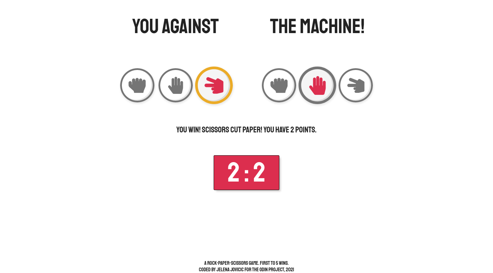

# The Odin Project - Rock, Paper, Scissors

A "Rock, Paper, Scissors" game, built for for [The Odin Project](https://www.theodinproject.com).

## Table of contents

- [Overview](#overview)
  - [Description](#description)
  - [Screenshot](#screenshot)
  - [Links](#links)
- [My process](#my-process)
  - [Built with](#built-with)
  - [Things I learned](#things-i-learned)
  - [Useful resources](#useful-resources)
- [Author](#author)

## Overview

### Description

The player is presented with two sets of buttons - player's choice and (unclickable) computer choice. Running score is also shown.

Once the player clicks on a button:

- A sound is played.
- A flip animation is played on computer choice buttons. 
- Both player's and computer choice buttons change in color and size.
- The round winner button gets another color change.
- A text message declares the round winner.

Once either player or computer reach 5 points: 

- A win or lose sound is played.
- Buttons get disabled.
- A fullscreen endgame message appears.
- A "New game" button is displayed.

### Screenshot

### Links

- [Solution](https://github.com/je-jo/rock-paper-scissors)
- [Live Site](https://je-jo.github.io/rock-paper-scissors/)

## My process

### Built with

- Semantic HTML5 markup
- CSS custom properties
- Flexbox
- Mobile-first workflow
- Javascript

### Things I learned

Stage 1 - CLI

- How to randomly pick items from an array.
- Function scope and functions working together. 
- Using loop.

Phase 2 - GUI

- Working with event listeners.
- First time using sound.
- Manipulate the DOM.
- Timing functions.

### Useful resources

- [Minireset](https://awesomeopensource.com/project/jgthms/minireset.css?categoryPage=29) - A tiny modern CSS reset. 
- [Fontawesome icons](https://fontawesome.com/)
- [This stackoverflow thread](https://stackoverflow.com/questions/22270664/how-to-remove-a-class-from-elements-in-pure-javascript) was helpful for me to understand that HTMLCollection is "live" as oposed to node list.
- [Box Shadows](https://box-shadow.dev/) A fun and useful tool for playing around with box shadows.
- [Wes Bos' Make a JS Drum Kit video](https://www.youtube.com/watch?v=VuN8qwZoego) - A great event listeners video tutorial. I also used sound files from this project.

## Author

- [Github](https://github.com/je-jo)
- [Frontend Mentor](https://www.frontendmentor.io/profile/je-jo)
- [Codepen](https://codepen.io/je-jo)